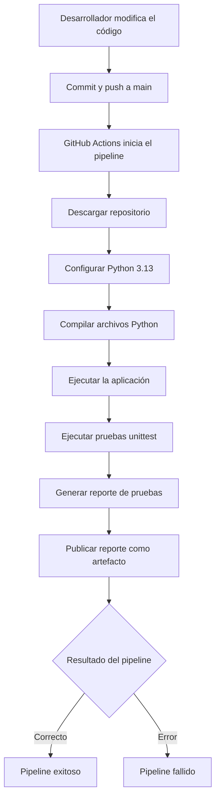

# Diagrama de integración continua

El pipeline se ejecuta automáticamente con cada `push` o `pull request` dirigido
a la rama `main`. También puede iniciarse manualmente desde la pestaña
**Actions** de GitHub mediante la opción **Run workflow**.
